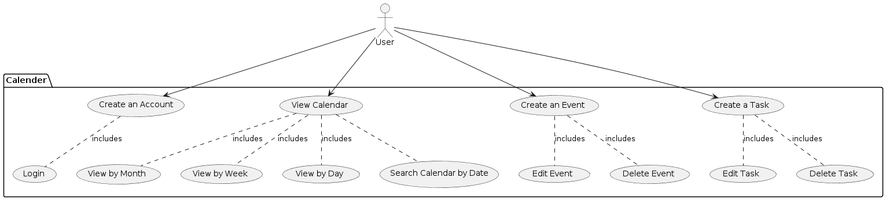
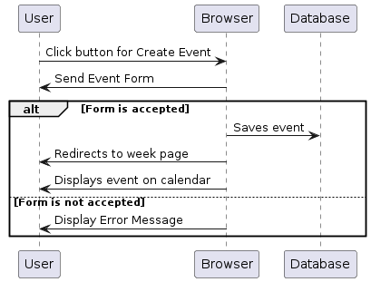
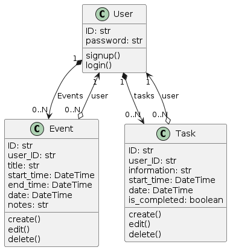

# Overview

COMING SOON! Grasp(TM) will revolutionize the way you manage your schedule and stay organized for all your events, meetings, and appointments. Our vision is to provide a FREE dynamic online calendar where individuals and organizations can seamlessly plan, coordinate, and track their activities. Whether you're organizing a conference, scheduling a team meeting, or simply planning your personal agenda, Grasp(TM) is your go-to destination. Join us SOON to help us shape the future of a FREE event scheduling platform.

# Design



## User Stories

Describe the user stories designed for the project, including clear acceptance criteria and point estimate for each of them. User stories must be consistent with the use case diagram. Refer to the user stories using US#1, US#2, etc. At least one of the user stories, not related to user creation or authentication, must be detailed by a sequence diagram. 


US#1 As a user, I want to be able to register for an account, which will have me create a password so that I will be able to authenticate myself.
```TODO: estimate of effort in terms of user story points: 2```

US#2 As a registered user on the platform, I want to be able to view the calendar as soon as I login, which will be accompanied with a menu that will allow me access to all of the important calendar pages that the site provides.
```TODO: estimate of effort in terms of user story points: 14```

US#3 As a registered user on the platform, I want to be able to create and edit events while I am looking at the calendar page which should reside within the correct date that the event is on.
```TODO: estimate of effort in terms of user story points: 12```

US#4 As a registered user on the platform, I want to be able to delete events that are on my calendar, which should be viewable once I commit the changes. 
```TODO: estimate of effort in terms of user story points: 5```

US#5 As a registered user on the platform, I should be able to be able to create a special event known as a task. A task is an event that needs to be completed by a certain time and not covering a time period which if it isn't completed in that time, it will be moved to the next timeslot, which should be able to be edited or deleted as well. 
```TODO: estimate of effort in terms of user story points: 14```

US#6 As a user on the platform, I want to be able to search the calendar for a certain date, task, or event of my choosing.
```TODO: estimate of effort in terms of user story points: 10```

## Sequence Diagram



## Model 



# Development Process 

NOTE: See scrum folder!

|Sprint#|Goals|Start|End|Done|Observations|
|---|---|---|---|---|---|
|1|US#1 thru US#5|04/26/24|05/04/24|US#1-US#5|See Sprint1.md|
|2|US#6, polish, tests|05/05/24|05/10/24|tests, Dockerfile|See Sprint2.md| 

# Testing 

Share in this section the results of the tests performed to attest to the quality of the developed product, including the coverage of the tests in relation to the written code. There is no minimum code coverage expectation for your tests, other than expecting "some" coverage through at least one white-box and one black-box test.

# Deployment 

The final product must demonstrate the integrity of at least 5 of the 6 planned user stories. The final product must be packaged in the form of a docker image. The project should be able to be deployed using: 

```
docker compose up
```
